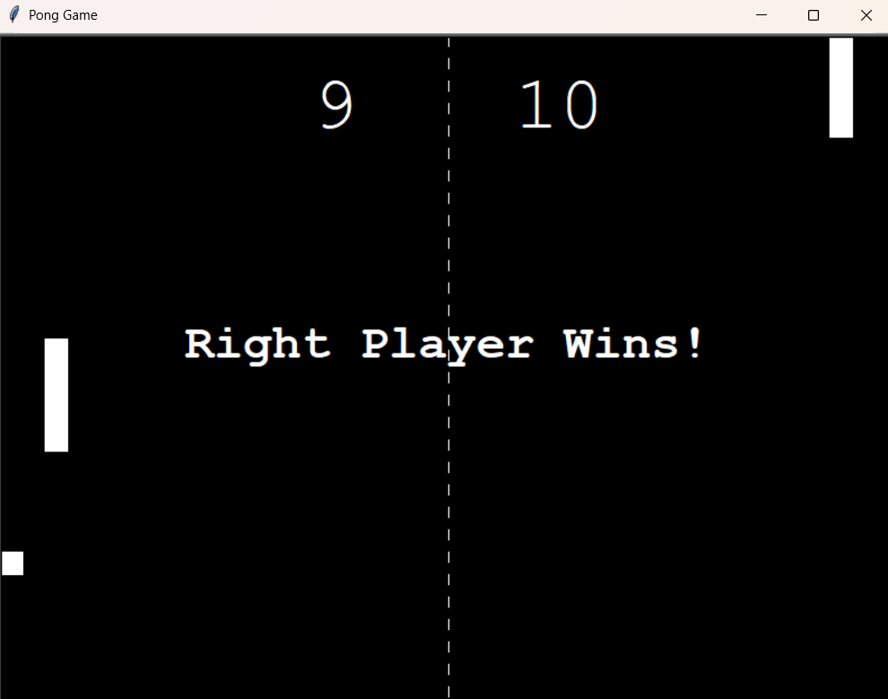

# 🏓 Pong Game (2-Player)

A classic **2-player Pong game** built using Python and the `turtle` module.  
Challenge your friend to a game of reflexes — the first player to reach **30 points** wins!

---

## 📸 Game Preview

  

---

## 🎮 Controls

### Player 1 (Left Paddle):
- `W` – Move Up  
- `S` – Move Down

### Player 2 (Right Paddle):
- `↑` – Move Up  
- `↓` – Move Down

---

## ✅ Features

- 🧱 Clean OOP structure (`Ball`, `Paddle`, `ScoreBoard`)
- 🔁 Ball bounces off top/bottom walls
- 🧲 Paddle collision with speed increase
- 🧮 Live score tracking
- 🏁 Game ends at 30 points with winner display
- 🎯 Responsive and smooth gameplay

---

## ▶️ How to Run

### Requirements:
- Python 3.x
- Turtle module (comes pre-installed)

### Run the game:

```bash
python main.py
